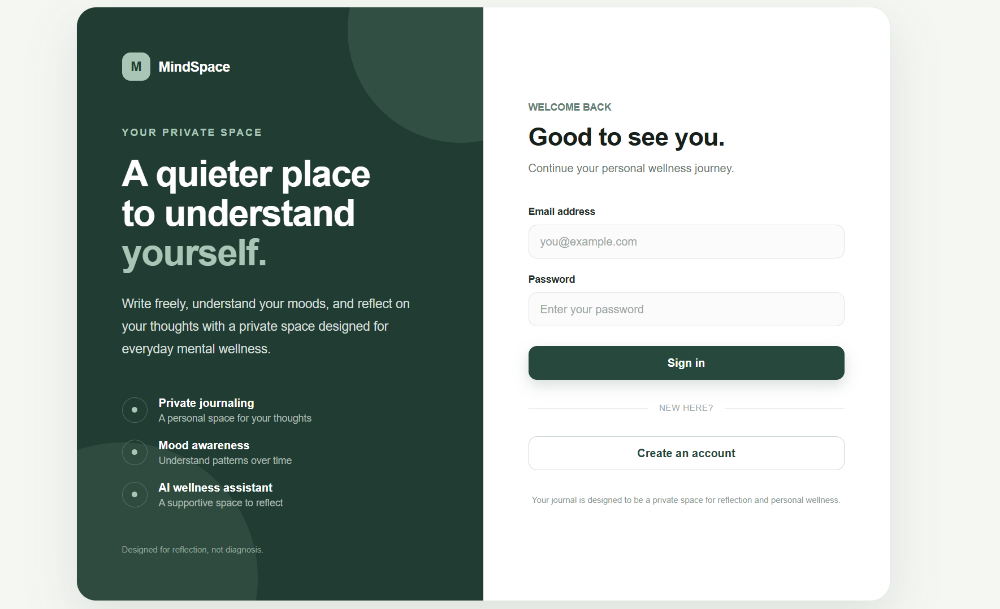
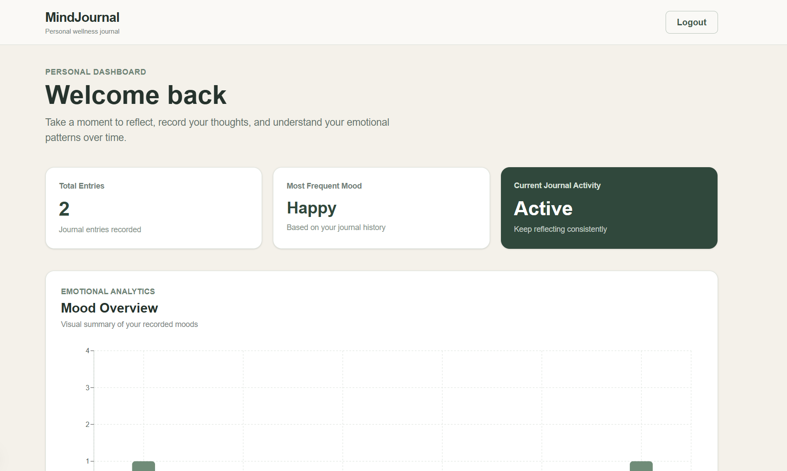
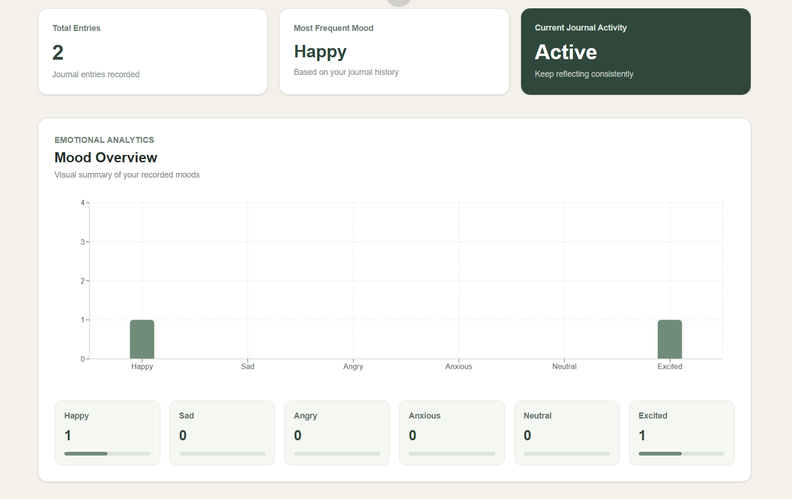
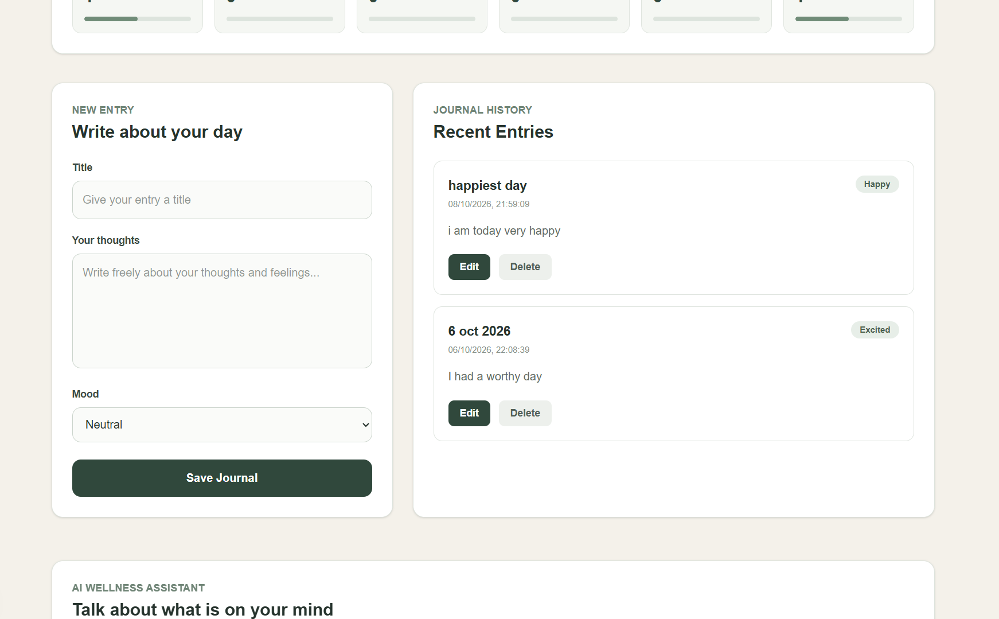
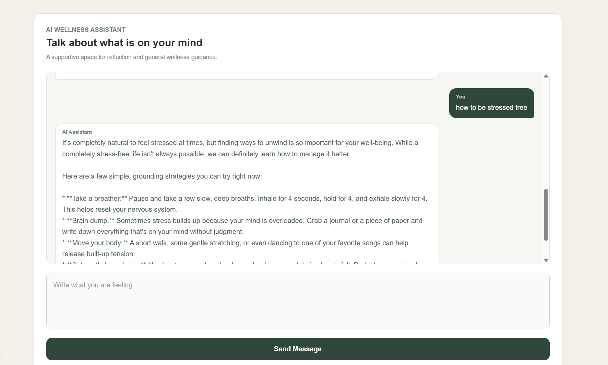

# Mental Health Journal and Chatbot

A full-stack AI-powered mental wellness application that helps users privately record journal entries, track moods, and interact with an AI wellness assistant.

## Features

- User registration and login
- JWT authentication
- Secure password hashing with bcrypt
- Private journal entries
- Create, edit, and delete journals
- Mood tracking
- Mood analytics
- AI-powered wellness chatbot
- Chat history
- MongoDB data persistence
- Responsive user interface

## Tech Stack

### Frontend
- Next.js
- React
- TypeScript
- Tailwind CSS

### Backend
- Node.js
- Express.js
- JWT
- bcrypt

### Database
- MongoDB Atlas
- Mongoose

### AI
- Google Gemini API

## Architecture

```text
Next.js / React Frontend
          |
          | REST API
          v
Node.js + Express Backend
       /        \
      v          v
 MongoDB       Gemini API
 Atlas

 ## Screenshots

### Login / Registration



### Dashboard



### Mood Analytics



### Journal



### AI Chatbot




## Installation and Setup

### Prerequisites

* Node.js and npm
* MongoDB Atlas account or a local MongoDB instance
* Google Gemini API key (for the chatbot)

### 1. Clone the repository

```bash
git clone https://github.com/Chetangit-2006/mental-health-journal.git
cd mental-health-journal
```

### 2. Set up the backend

```bash
cd backend
npm install
```

Create a `.env` file in the backend folder and configure the required environment variables. Use `.env.example` if available.

Start the backend using the command configured in your backend `package.json`, for example:

```bash
node server.js
```

### 3. Set up the frontend

Open a separate terminal:

```bash
cd frontend
npm install
npm run dev
```

### 4. Open the application

Visit:
http://localhost:3000

### Security

Never commit API keys, database credentials, passwords, or JWT secrets to GitHub.

